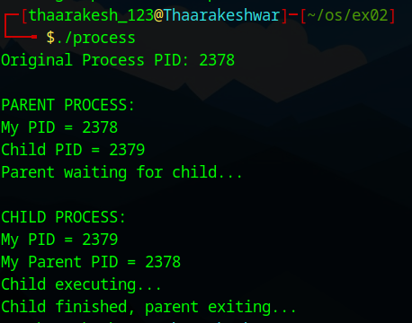
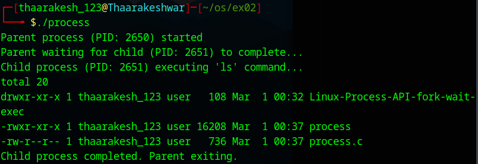

# Linux-Process-API-fork-wait-exec-
Ex02-Linux Process API-fork(), wait(), exec()
# Ex02-OS-Linux-Process API - fork(), wait(), exec()
Operating systems Lab exercise

# AIM:
To write C Program that uses Linux Process API - fork(), wait(), exec()

# DESIGN STEPS:

### Step 1:

Navigate to any Linux environment installed on the system or installed inside a virtual environment like virtual box/vmware or online linux JSLinux (https://bellard.org/jslinux/vm.html?url=alpine-x86.cfg&mem=192) or docker.

### Step 2:

Write the C Program using Linux Process API - fork(), wait(), exec()

### Step 3:

Test the C Program for the desired output. 

# PROGRAM:

## C Program to create new process using Linux API system calls fork() and getpid() , getppid() and to print process ID and parent Process ID using Linux API system calls

vi process.c

#include <stdio.h>
#include <unistd.h>
#include <sys/types.h>
#include <sys/wait.h>

int main()
{
    pid_t pid;
    
    printf("Original Process PID: %d\n", getpid());
    
    pid = fork();
    
    if (pid < 0) {
        printf("Fork failed!\n");
        return 1;
    }
    else if (pid == 0) {
        // Child process
        printf("\nCHILD PROCESS:\n");
        printf("My PID = %d\n", getpid());
        printf("My Parent PID = %d\n", getppid());
        printf("Child executing...\n");
    }
    else {
        // Parent process
        printf("\nPARENT PROCESS:\n");
        printf("My PID = %d\n", getpid());
        printf("Child PID = %d\n", pid);
        printf("Parent waiting for child...\n");
        wait(NULL);
        printf("Child finished, parent exiting...\n");
    }
    
    return 0;
}

gcc process.c -o process

./process

## OUTPUT 

## C Program to execute Linux system commands using Linux API system calls exec() , exit() , wait() family

nano process.c

#include <stdio.h>
#include <unistd.h>
#include <sys/wait.h>

int main()
{
    pid_t pid;
    int status;
    
    printf("Parent process (PID: %d) started\n", getpid());
    
    pid = fork();
    
    if (pid < 0) {
        printf("Fork failed!\n");
        return 1;
    }
    else if (pid == 0) {
        // Child process
        printf("Child process (PID: %d) executing 'ls' command...\n", getpid());
        execl("/bin/ls", "ls", "-l", NULL);
        printf("exec() failed!\n");
        return 1;
    }
    else {
        // Parent process
        printf("Parent waiting for child (PID: %d) to complete...\n", pid);
        wait(&status);
        printf("Child process completed. Parent exiting.\n");
    }
    
    return 0;
}

gcc process.c -o process

ls -l process

./process

## OUTPUT

## RESULT:
The programs are executed successfully.
